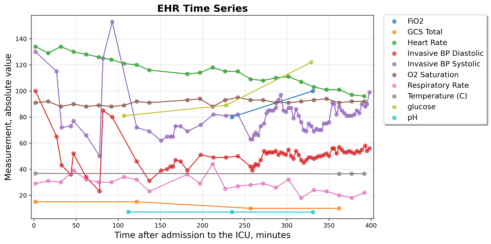
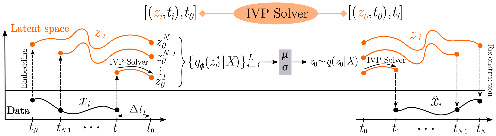

# IVP-VAE: Modeling EHR Time Series with Initial Value Problem Solvers

## Overview
This is the official PyTorch implementation of the **AAAI 2024** paper *IVP-VAE: Modeling EHR Time Series with Initial Value Problem Solvers*.

---
Relevant resources:

Full paper: https://arxiv.org/abs/2305.06741

Presentation Recording: https://www.youtube.com/watch?v=JReUWXgAsLQ

Slides: https://drive.google.com/file/d/1yuUIPIfL2ZFinb-_4abRYdyW8jfLcON3

---

This repository contains model source code and data preprocessing programs.

Electronic Health Record (EHR) data contains multi-variate time series of patient information, such as vital signs and laboratory results. EHR time series is often irregularly sampled (i.e., unequal time intervals between successive measurements) and can have missing values. The irregularity is caused mainly due to unstructured manual processes, event-driven recordings, device failure, and also different sampling frequencies across multiple variables. These complexities make learning and modeling clinical time series data particularly challenging for classical machine learning models.
<!-- ![EHR Time Series Example] -->
<p align="center">
    
</p>

In this work,
- We propose a novel continuous-time model IVP-VAE which can capture sequential patterns of EHR time series by purely solving multiple IVPs in parallel.

- By utilizing the invertibility property of IVP solvers, we achieve parameter sharing between encoder and decoder of the VAE architecture, and thus provide a more efficient generative modeling
technique.

- Across real-world datasets on both forecast and classification tasks, IVP-VAE achieves comparable results while significantly increasing efficiency.

- IVP-VAE achieves significant improvements over baseline models in settings where the training data is limited.

<!-- ![IVP-VAE idea] -->
<p align="center">
    
</p>


## Requirements

IVP-VAE has tested using Python 3.10 and Conda environment management tool.

To have consistent libraries and their versions, you can install needed dependencies 
for this project running the following command:

```
conda env create -f environment.yml
```

Because some dependent libraries are constantly being updated and changed, in order to ensure the successful execution of the code, we added two historical versions of the dependent libraries ([torchdiffeq](https://github.com/rtqichen/torchdiffeq) and [stribor](https://github.com/mbilos/stribor)) in the "*libs*" folder.

## Datasets

We used 3 public EHR datasets in the experiments. MIMIC-IV and eICU need users to register as a credentialed user and sign a data use agreement on the PhysioNet Platform (https://physionet.org/), to obtain the access. PhysioNet 2012 can be freely obtained without registration.


### MIMIC-IV

- **Obtain**: We used MIMIC-IV v1.0, which can be downloaded from https://physionet.org/content/mimiciv/1.0/. 

- **Preprocess**: The preprocessing programs can be found in folder "*preprocess/pre_mimic4*". They were adapted from the repository of [Neural Flow](https://github.com/mbilos/neural-flows-experiments/tree/master/nfe/experiments/gru_ode_bayes/data_preproc).

### eICU

- **Obtain**: We used eICU v2.0, which can be downloaded from https://physionet.org/content/eicu-crd/2.0/.

- **Preprocess**: The preprocessing programs can be found in folder "*preprocess/pre_eicu*". They were developed upon a [previous work](https://github.com/mostafaalishahi/eICU_Benchmark).

### PhysioNet 2012

- **Obtain**: We used PhysioNet 2012 v1.0, which can be downloaded from https://physionet.org/content/challenge-2012/1.0.0/. 

- **Preprocess**: The automatic downloading and preprocessing code is in file "*experiments/data_physionet12.py*". This file was built upon a [previous program](https://github.com/mbilos/neural-flows-experiments/blob/master/nfe/experiments/latent_ode/physionet.py).


We organize the well-processed and original data in the similar way for three datasets. Next we introduce the files, taking *PhysioNet12* folder as an example. After downloading and preprocessing data, inside the "*data/PhysioNet12*" folder, we have the following structure:

- *raw*
    - The downloaded raw data
- *processed*
    - *p12\_data.csv*: The processed ready-to-use time series data file.
    - *p12\_labels.csv*: Mortality information of all samples.  


## Experiments

All three datasets are used for forecasting and classification experiments, and each of them contains 48 hours of observation after ICU admission. Each dataset is randomly split into 80% for training, 10%
for validation and 10% for testing. We repeat each experiment five times using different random seeds to split datasets and initialize model parameters. More experiment details can be found in our paper. 

**Setting 1: Time series forecasting** In forecasting experiments, we use the first 24 hours of data as input and prediction the next 24 hours of data.

**Setting 2: Time series classification** In classification experiments, we focus on predicting in-hospital mortality using the first 24 hours of data.


## Running the code

With Neural ODEs or Neural Flows as the IVP solver, there are two variants of IVP-VAE, i.e. IVP-VAE-ODE and IVP-VAE-Flow. Taking PhysioNet 2012 as an example, we show how to run IVP-VAE models for forecasting and classification tasks. 

Run IVP-VAE-ODE on PhysioNet 2012 dataset for time series forecasting:

```
python main.py --random-state 1 --ml-task extrap --ivp-solver ode --combine-methods kl_weighted --data p12 --time-scale constant --time-max 2880
```

Run IVP-VAE-Flow on PhysioNet 2012 dataset for time series forecasting:

```
python main.py --random-state 1 --ml-task extrap --ivp-solver resnetflow --combine-methods kl_weighted --data p12 --time-scale constant --time-max 2880
```

Run IVP-VAE-ODE on PhysioNet 2012 dataset for time series classification:

```
python main.py --random-state 1 --ml-task biclass --ivp-solver ode --data p12 --time-max 1439 --ratio-ce 100
```

Run IVP-VAE-Flow on PhysioNet 2012 dataset for time series classification:

```
python main.py --random-state 1 --ml-task biclass --ivp-solver resnetflow --data p12 --time-max 1439 --ratio-ce 100
```


## License

IVP-VAE is licensed under the MIT License.

## Acknowledgement
We appreciate the following baseline works for their valuable code and data for irregular time series analysis:

https://github.com/YuliaRubanova/latent_ode

https://github.com/mbilos/neural-flows-experiments

https://github.com/edebrouwer/gru_ode_bayes

https://github.com/mims-harvard/Raindrop

https://github.com/reml-lab/mTAN

https://github.com/boschresearch/Continuous-Recurrent-Units
